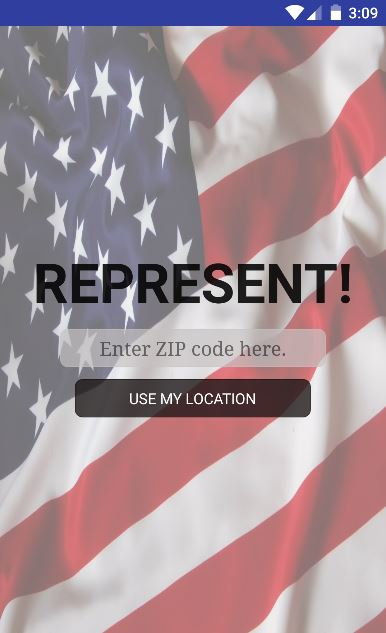
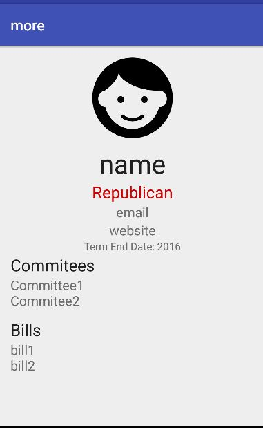
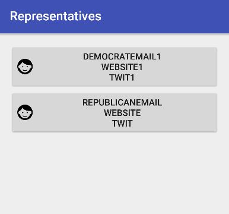
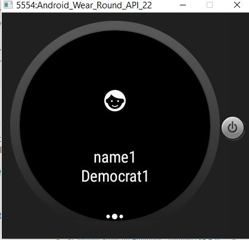
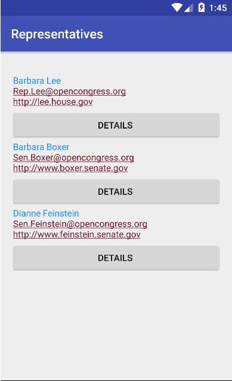
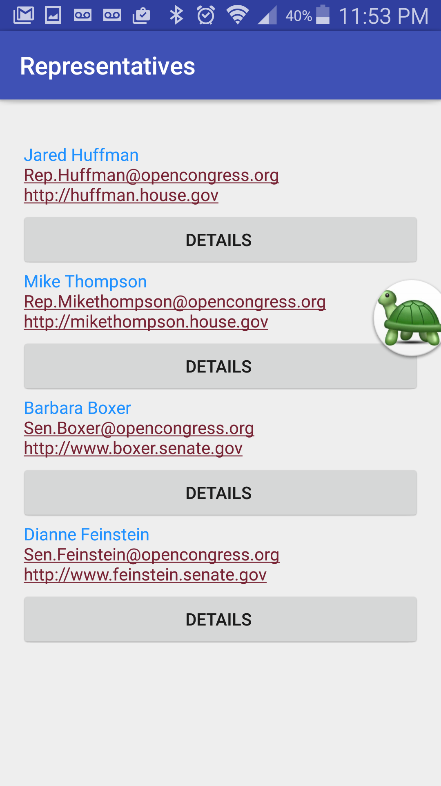
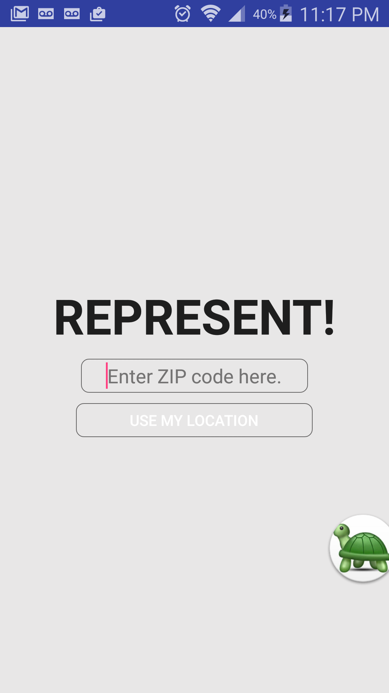

# PROG 02: Represent!

Well, while making this app i really was plunged headfirst into apis and really spent a lot of time figureing things out but failed so hard. Due to technical issues, I personally was not able to test out the phone-> watch part beyond part 2B because my computer kept crashing, so I do not think my watch emulator can handle my app? 

## Authors

Jenny Lu ([j.lu@berkeley.edu](mailto:your_email@berkeley.edu))

## Demo Video

See [Represent Demo] (https://www.youtube.com/watch?v=6KvGxPFPPcA)

## Screenshots

## Acknowledgments

* Hat tip to anyone who's code was used
* http://www.learnandroidwear.com/sample-3/
* the staff
* 
* Any other support
